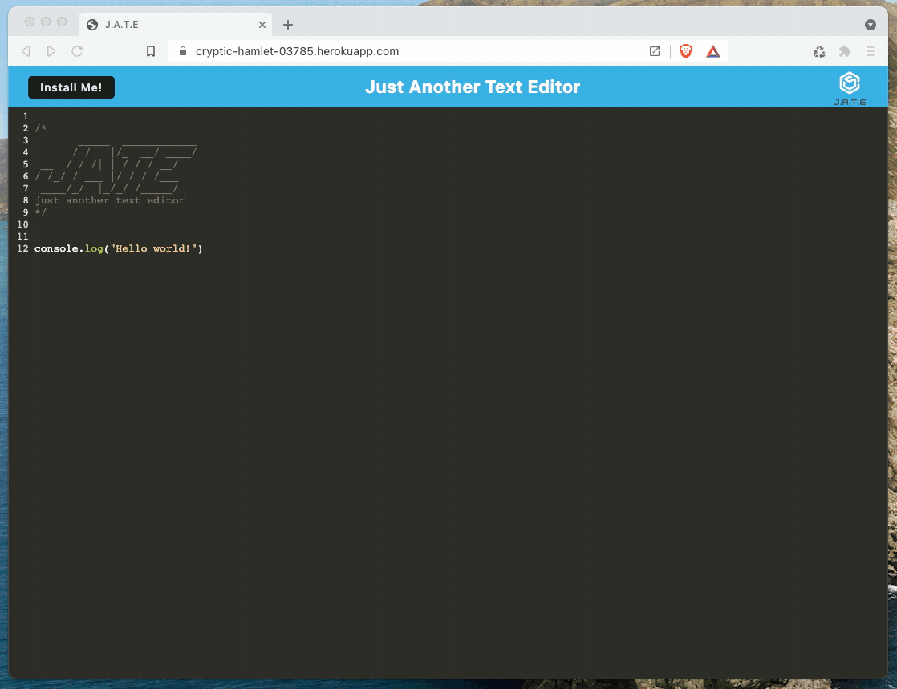

# Unit 19 PWA Homework: Text Editor

## Table of Contents
- [Description](#description)
- [Credits](#credits)
- [License](#license)

## Description
This application is a text editor that runs in the browser. The app is a single-page application that meets the Progressive Web Application criteria. It also features a number of data persistence techniques that serve as redundancy in case one of the options is not supported by the browser. This combining these technologies and techniques means the application will also function offline.

Visit the live site at: https://jd-notes.herokuapp.com

### Mock-Up

The following animation demonstrates the application functionality:

## Credits
This project idea is part of the [Adelaide University Coding Boot Camp](https://bootcamps.adelaide.edu.au).

## License
This project is released under the [MIT License](LICENSE)